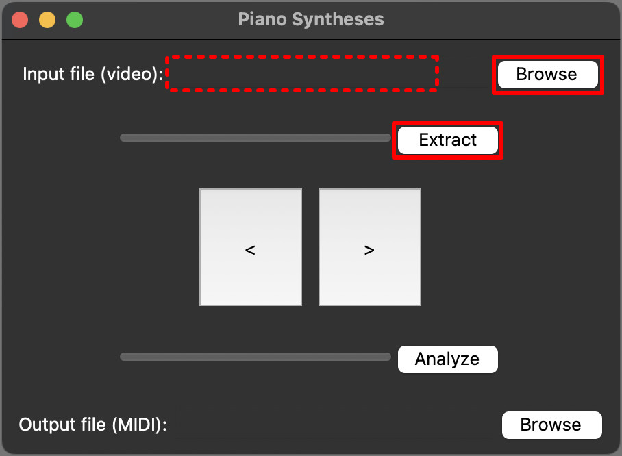
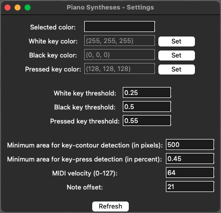

# Piano Syntheses

Convert piano videos into MIDI using classical computer vision.

## What It Does

This app takes a video file where piano keys light up (e.g. Synthesia visuals), detects the keyboard, tracks pressed keys frame by frame and writes a MIDI file.

## How It Works

1. Extract all frames from the video.
2. Detect 88 key bounding boxes by color segmentation.
3. Track pressed keys in each frame using a pressed-color mask.
4. Convert frame-by-frame key states into MIDI note events.

## Project Structure

- `src/gui.py` GUI components
- `src/cv.py` computer-vision pipeline
- `src/main.py` main entry point for the app
- `docs/` additional documentation on the pipeline and algorithms

## Setup

Create a virtual environment and install dependencies:
```
uv sync
```

## Usage

Launch the GUI:
```
uv run src/main.py
```

Follow the in-app flow:
- Select a video
- Extract frames
- Click a preview frame to sample colors and tune thresholds
- Preview until all 88 keys are detected
- Choose a MIDI output file and analyze

## Screenshots

### Step 1: Select a video file as input and extract frames


### Step 2: Select a frame, on which every key is recognized


### Step 3: Adjust settings in the separate window


### Step 4: Select a MIDI file as output and analyze frames


## Limitations

- Assumes a fixed camera and a full 88-key keyboard in view.
- Works best with bright, high-contrast key colors.
- Does not capture dynamics or pedal data beyond a fixed velocity.
- Sensitive to compression artifacts, glare, or motion blur.
