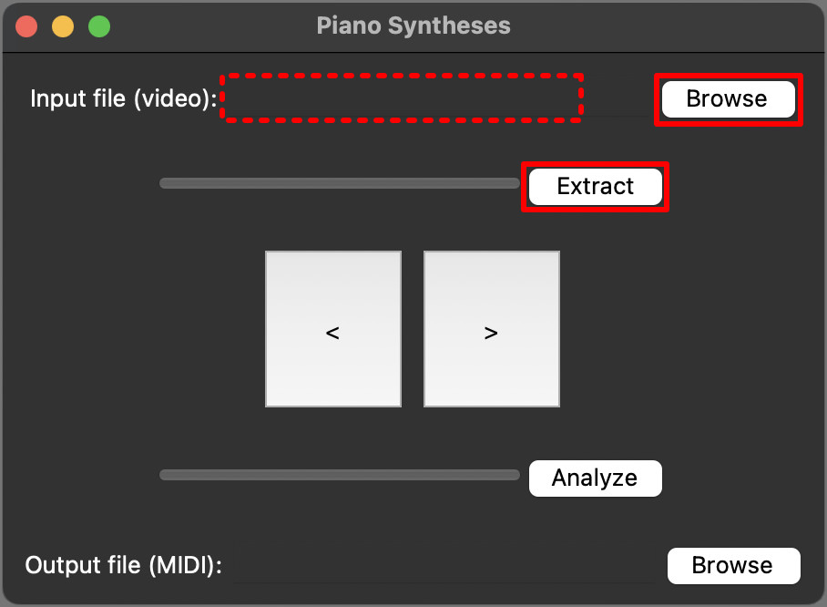
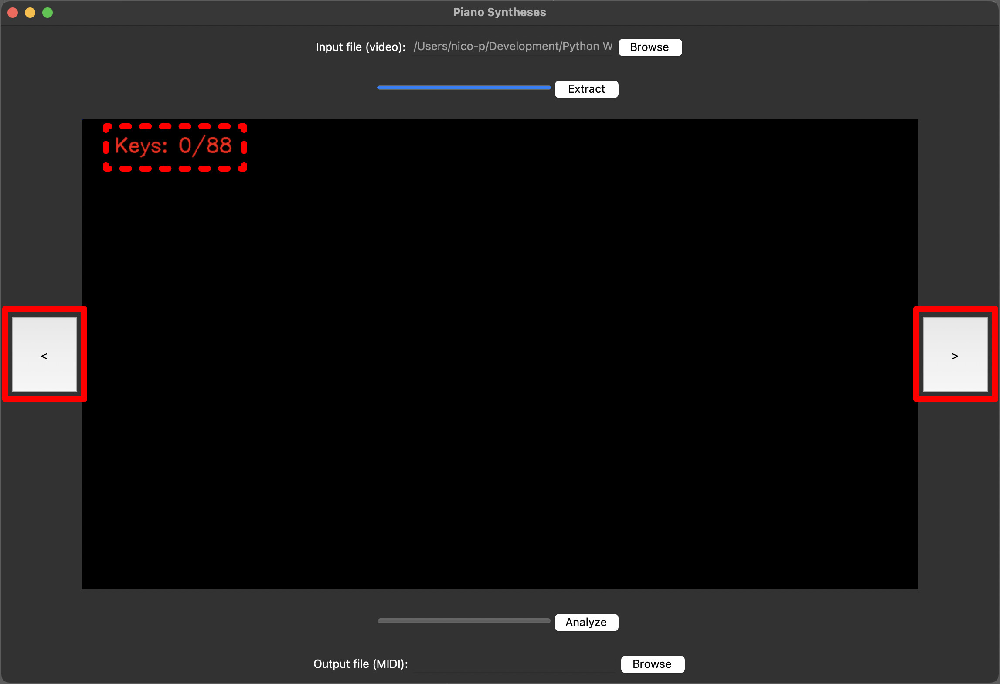

# Piano Syntheses

> A universal video to midi converter.

## Table of Contents

* [Introduction](#introduction)
* [Features](#features)
* [Screenshots](#screenshots)
* [Dependencies](#dependencies)
* [Setup](#setup)
* [Usage](#usage)
* [Acknowledgements](#acknowledgements)

## Introduction

- This tool converts any video (e.g. from Synthesia) into a midi file.
- Useful if no sheets are provided with the video.
- For best results, use a video with high fps.

## Features

- Compatible with any tempo or scale
- Universal key-position recognition
- Universal key-color recognition

## Screenshots

 
*Step 1: Select a video file as input and extract frames*

 
*Step 2: Select a frame, on which every key is recognized*

 
*Step 3: Adjust settings in the separate window*

 
*Step 4: Select a midi file as output and analyze frames*

## Dependencies

- cv2
- mido
- numpy
- PIL
- tkinter (shipped with python)

## Setup

Use `pip install -r requirements.txt` to install all necessary dependencies.

## Usage

- Move to the `src` directory.
- Use `python main.py` to start the program.
- Follow along the screenshots.

## Acknowledgements

This project was inspired by myself, since there was no suitable alternative.

*Original idea in December 2023*
